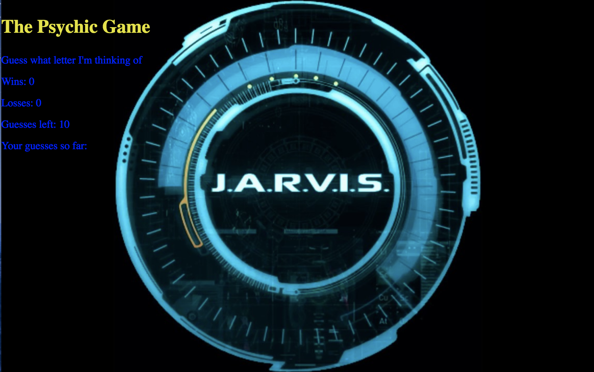

# Psychic-Game

Created a game where the computer chooses a random letter and the user has the figure out which letter. Scores include wins and losses with AI being the main theme for this program. 

# Link to Deployed Site
[Psychic-Game](file:///Users/muhammadawais/Desktop/Psychic-Game/index.html)

# Images 



# Technology Used 
- HTML
- CSS
- Javascript

# Code Snippets
```
document.onkeyup = function(event)
{
        var userGuess = event.key;
        guess.push(userGuess);

        if(letter.indexOf(userGuess) ===-1)
         {
            letter.push(userGuess);   
         }
        else
        {
            guessLeft++;
            alert("Please pick another letter");
        }

        var computerGuess = letters[Math.floor(Math.random() * letters.length)];
        console.log(computerGuess);
}
```
# Learned Materials
I learned to use Javascript to set up the game rules along with wins/losses. Style and background is CSS with HTML.

# Author
[Muhammad Awais](https://github.com/mawais54013/Bootstrap-Portfolio)